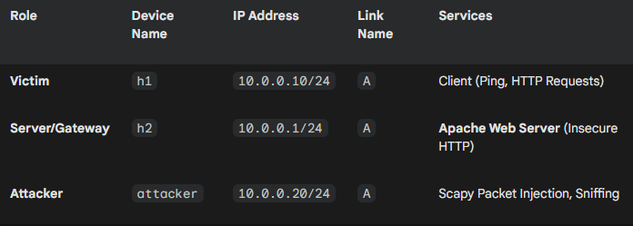

# ARP Spoofing & MITM Attack — Lab Demonstration

## Overview
The lab demonstrates a Man-in-The-Middle attack where the threat actor intercepts packets before they are able to reach their destination.

An attack like this shows how our info can be easily intercepted without our knowledge since on the surface nothing seems out of place.

The main attributing factor is how ARP operates - **It lacks any authentication** whether the reply is legitimate or **whether the reply was actually even solicited in the first place**
ARP accepts replies even without sending a request first, This is what makes unsolicited ARP replies possible and the attack so effective.

## Environment & Tools
Kathará - Docker-based network emulation tool that doesnt require image files, thus lightweight compared to other such as CML or GNS3
Scapy - Python library for crafting, sending, and capturing network packets at a low level (ethernet frames / ARP headers / raw packet bytes)
Docker — Containerisation Platform that allows us to host multiple interconnected devices

## Network Topology

## How It Works

Walk through the attack flow — ARP poisoning → traffic redirection → credential capture
This is where you explain the *why*, not just the *how*

## Key Results
Screenshots here — before/after ARP cache, captured credentials

## Defensive Countermeasures
DAI, HTTPS/TLS — what would have stopped this

## References / What I Learned