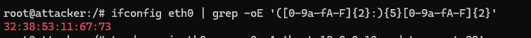
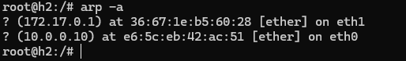
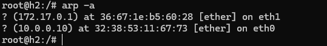
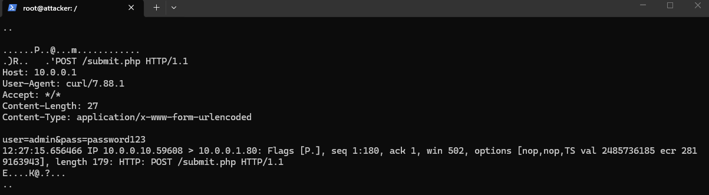

# ARP Spoofing & MITM Attack — Lab Demonstration

## Overview
The lab demonstrates a Man-in-The-Middle attack where the threat actor intercepts packets before they are able to reach their destination.

An attack like this shows how our info can be easily intercepted without our knowledge since on the surface nothing seems out of place.

The main attributing factor is how ARP operates - **It lacks any authentication** whether the reply is legitimate or **whether the reply was actually even solicited in the first place**

ARP accepts replies even without sending a request first, This is what makes unsolicited ARP replies possible and the attack so effective.

## Environment & Tools
Kathará - Docker-based network emulation tool that doesnt require image files, thus lightweight compared to other such as CML or GNS3

Scapy - Python library for crafting, sending, and capturing network packets at a low level (ethernet frames / ARP headers / raw packet bytes)

Docker — Containerisation Platform that allows us to host multiple interconnected devices

## Network Topology

## How It Works
The threat actor would have to act as a router to effectively become the Man-in-The-Middle so that packets that are from the victim(h1) meant for server(h2) goes through him first before reaching the desired destination.

The attack flow — ARP poisoning → traffic redirection → credential capture

### ARP Poisoning
The ARP table before any malicious activity would point to the correct MAC address that is associated with that IP address. What ARP Poisoning does is the threat actor would give a false ARP reply to its desired target to basically 'Poison' that device's ARP table by claiming to be the MAC address associated with the legitimate IP address. This successfully makes the device think that it is sending packets to the right host, although it would be far from the truth.

### Traffic Redirection
Just poisoning one side's ARP table would actually sound off alarms in the network, since the receiving end would notice that they didn't receive the promised packet. So, to overcome this issue, the threat actor would redirect traffic as if the packet didn't even pass through him, making an illusion of direct communication. 

Traffic redirection is done by the threat actor poisoning the ARP tables of both sides (the victim and server), effectively making the victim think he is sending the packet directly to the server and the server think it is sending the packet directly to the victim.

When the packet arrives at the attacker machine, it is automatically rerouted to its actual destination; avoiding any suspicious behavior

### Credential Capture
Credential Capture would occur in that slight moment that the packet stays in the attackers grasp before redirecting it to its actual destination. During that time the packet sniffer script is what will actually decode the packet, so that valuable information can actually be extracted.

In this particular instance, the packet sniffer script would look for the HTTP POST method and strings that contain user= or pass= (this would be specific tailored to the server being targeted)

## Key Results
### Attacker MAC Address

### Before ARP Poisoning

### After ARP Poisoning

### Captured Credentials

## Defensive Countermeasures
DAI, HTTPS/TLS — what would have stopped this

## References / What I Learned